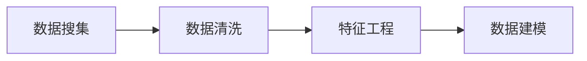

*听课时候随手记的，并没有想让大家看懂的意思  ：)*

机器学习流程：

前三个部分日常最多80%-90%时间

数学建模需要最多的知识

### 监督学习

+ 回归问题：标签连续
+ 分类问题：标签离散

## 回归

### 线性回归

+ 线性模型
+ 找到直线、平面、或者超平面是的预测值与真实值之间误差最小
+ 距离为0则完全拟合

### 符号约定

+ **m：训练集中的样本数量**
+ **n：特征数量**
+ **x：特征/输入变量**
+ **y：目标变量/输出变量**
+ **（x， y）：训练集中的样本**

默认为列向量

+ **$x^{(i)}$：特征矩阵中的第i行（默认为列向量）**
+ **$x^{(i)}_j$：矩阵中第i行第j个特征**
+ **$h：$代表学习算法的解决方案或函数也成为假设**
+ **$\widehat{y}=h(x) $：代表预测值**
+ **$h：$假设**

#### 最小二乘法

$$
h(x) = w_0 + w_1x_1 + w_2x_2 + ... + w_nx_n
$$

+ 找到一组

$$
w(w_0, w_1, w_2,..., w_n)
$$

+ 使得残差平方和

$$
J(w) = \frac{1}{2} {\textstyle \sum_{i = 1}^{m}}(h(x^{(i)}) - y^{(i)})^{2}
$$

最小，即最小化$\frac{\partial J(w)}{\partial w}.$

+ 将上式转换为矩阵形式

$$
J(w) = \frac{1}{2}(Xw - Y)^{2}
$$

+ 其中$X$为$m$行$n+1$列的矩阵（$m为样本个数， n为特征个数$）
+ $w为n+1行1列的矩阵（包含w_0）,Y为m行1列的矩阵$

**根据向量的性质：**
$$
\sum_{i}Z_{i}^2 = Z^TZ
$$
**可以得到：**
$$
J(w) = \frac{1}{2}(Xw - Y)^{2} = \frac{1}{2}(Xw - Y)^{T}(Xw - Y)
$$
**未来最小化$J(w)$，对其求偏导：**
$$
\frac{\partial J(w)}{\partial w} = \frac{1}{2} \frac{\partial}{\partial w} (Xw - Y)^T(Xw - Y) = \frac{1}{2} \frac{\partial}{\partial w} (w^TX^TXw - {\color{Red} Y^TXw  - w^TX^TY} + Y^TY)
$$
**红色两项互为转置**
$$
\frac{\partial J(w)}{\partial w} = \frac{1}{2} \frac{\partial}{\partial w}  (w^TX^TXw - 2w^TX^TY + Y^TY) = \frac{1}{2}(2X^TXw - 2X^Ty + 0)\\=X^TXw - X^Ty
$$

$$
令 \frac{\partial J(w)}{\partial w} = 0
$$

则有
$$
w = (X^TX)^{-1}X^Ty
$$
***注意以下法则***
$$
\frac{dX^TX}{dX} = 2X
$$

$$
\frac{dAX}{dX}
$$

$$
\frac{\partial X^TAX}{\partial X} = (A + A^T)X,	若A为对称矩阵， \frac{\partial X^TAX}{\partial X} = 2AX
$$

